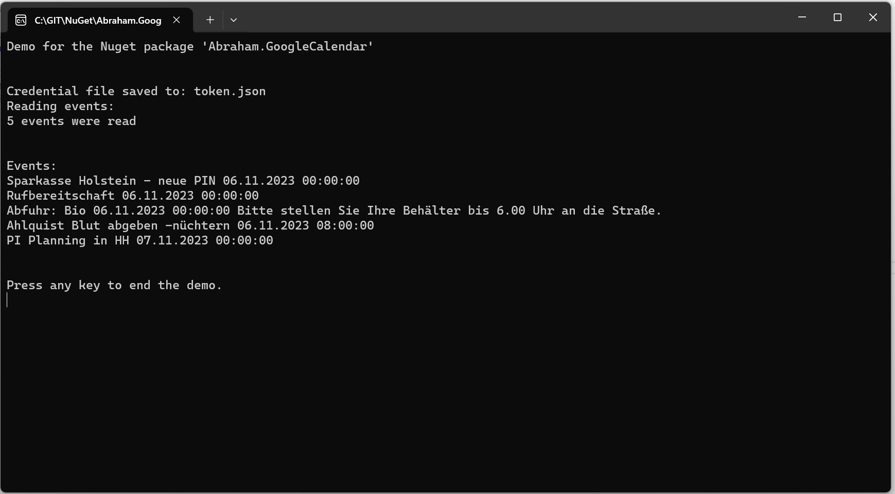

# Abraham.GoogleCalendar

## OVERVIEW

Read entries from a google calendar easily.
Possible with only one line of code.
For examples, please refer to the demo project on github.


## License

Licensed under Apache licence.
https://www.apache.org/licenses/LICENSE-2.0


## Compatibility

The nuget package was build with DotNET 6.


## INSTALLATION

Install the Nuget package "Abraham.GoogleCalendar" into your application (from https://www.nuget.org).

Add the following code:
```C#
using Abraham.GoogleCalendar;

var events = new GoogleCalendarReader()
    .UseCredentialsFile(@"C:\Credentials\CoogleCalendarReaderNugetPackageDemo.json")
    .UseApplicationName("MyGoogleClient")
    .ReadEvents();
```


That's it!
This one-liner will read all events starting from now.

For more options, please refer to my Demo application in this repository (see below).
The Demo and the nuget source code is well documented.


## HOW TO INSTALL A NUGET PACKAGE
This is very simple:
- Start Visual Studio (with NuGet installed) 
- Right-click on your project's References and choose "Manage NuGet Packages..."
- Choose Online category from the left
- Enter the name of the nuget package to the top right search and hit enter
- Choose your package from search results and hit install
- Done!


or from NuGet Command-Line:

    Install-Package Abraham.GoogleCalendar


## AUTHOR

Oliver Abraham, mail@oliver-abraham.de, https://www.oliver-abraham.de

Please feel free to comment and suggest improvements!


## SOURCE CODE

The source code is hosted at:

https://github.com/OliverAbraham/Abraham.GoogleCalendar

The Nuget Package is hosted at: 

https://www.nuget.org/packages/Abraham.GoogleCalendar


## SCREENSHOTS




# MAKE A DONATION !

If you find this application useful, buy me a coffee!
I would appreciate a small donation on https://www.buymeacoffee.com/oliverabraham
